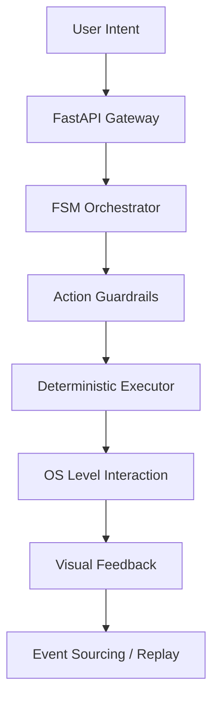

# <p align="center"><br>AEGIS</p>

<p align="center">
  <b>Autonomous Runtime Operating System & AI Copilot</b><br>
  <i>Stabilite • Kontrol • Genişletilebilirlik • Zeka • Otonomi</i>
</p>

<p align="center">
  
  
  
</p>

---

## 🛡️ Overview

Aegis is a **production-grade autonomous runtime system** designed to act as a secure, local-first desktop AI copilot. Unlike traditional agents, Aegis operates on a **deterministic core** with formal state management, ensuring that every action is verifiable, reproducible, and resilient to failure.

It understands your screen, manages your files, and executes complex automation tasks through a hardened execution pipeline.

## 🚀 Key Features

- **🧠 Hardened Orchestrator**: Formal State Machine (FSM) driven execution flow with bi-directional command processing.
- **🛡️ Deterministic Core**: Tier 4.5 formal verification enforcing pre-conditions, transitions, and post-condition invariants.
- **👁️ Vision Lab & Observability**: Real-time multi-modal vision processing with desktop mirroring and "Ghost Cursor" feedback.
- **🔥 Chaos Shield**: Advanced safety layer and action guardrails to prevent unauthorized or risky system interactions.
- **🔄 Event Sourcing**: Append-only event logging for full auditability and state replayability.
- **💻 Local-First Intelligence**: Native integration with **LM Studio** and **Ollama**, ensuring privacy and low-latency performance.

## 🏗️ System Architecture

Aegis follows a strict deterministic pipeline to ensure system stability:



## 🛠️ Technology Stack

| Layer | Technology |
| :--- | :--- |
| **Backend** | Python 3.11+, FastAPI, Pydantic V2 |
| **Frontend** | Next.js 15, TailwindCSS, Framer Motion |
| **Desktop** | Electron Bridge |
| **Automation** | PyAutoGUI, Playwright, PyGetWindow |
| **Database** | Qdrant (Vector), JSONL (Event Sourcing) |
| **Models** | Ollama, LM Studio (Qwen 2.5, Llama 3.1) |

## ⚡ Quick Start

### Prerequisites
- **Python**: 3.11+
- **Node.js**: 20+
- **Hardware**: RTX 3080+ (Recommended for local vision models)

### Installation

1. **Clone & Setup Environment**
   ```powershell
   git clone https://github.com/your-repo/aegis.git
   cd aegis
   python -m venv .venv
   .\.venv\Scripts\activate
   pip install -e ".[dev]"
   ```

2. **Configure Environment**
   ```powershell
   copy .env.example .env
   # Edit .env with your local model endpoints (e.g., LM Studio/Ollama)
   ```

3. **Launch the System**
   ```powershell
   # Launch both Backend and Frontend via the automated script
   .\launch_aegis.bat
   ```

## Windows Troubleshooting

### PATH checks

Use explicit Windows commands when a tool exists but PowerShell cannot find it:

```powershell
where.exe git
where.exe node
where.exe npm.cmd
.\.venv\Scripts\python.exe -m pytest -q
```

If Git is installed but `where.exe git` does not find it, add Git for Windows to
your user PATH and open a new terminal:

```powershell
[Environment]::SetEnvironmentVariable(
  "Path",
  [Environment]::GetEnvironmentVariable("Path", "User") + ";C:\Program Files\Git\cmd",
  "User"
)
```

For the current terminal only, use:

```powershell
$env:Path += ";C:\Program Files\Git\cmd"
```

### Node and UI testing

Prefer `npm.cmd` on Windows:

```powershell
cd frontend
npm.cmd run build
```

Aegis keeps browser smoke testing on the Python Playwright dependency already in
the backend environment, so a missing Codex Node REPL/browser helper does not
require adding a separate JavaScript test stack.

## 📊 Project Status

Aegis is currently in **Phase 9: Assisted Autonomy**. We are transitioning towards full agentic loops (Phase 10) with a focus on self-healing capabilities and complex multi-intent routing.

---

<p align="center">
  <i>Developed with precision for the next generation of autonomous computing.</i>
</p>
