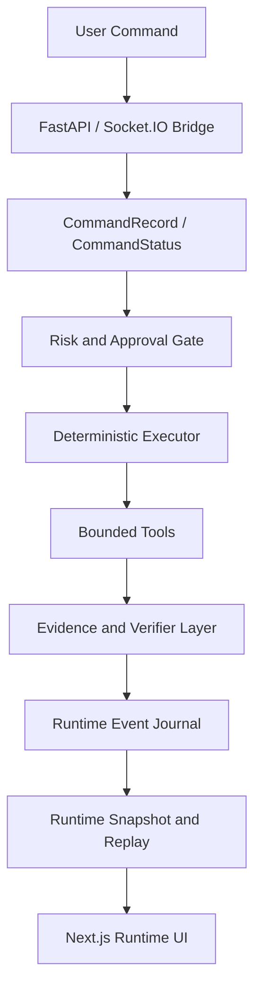

# Aegis

**Aegis is a local-first, verification-backed AI control plane and AI computer operator runtime for Windows.**

The Aegis GitHub repository, `WexyS/Aegis`, is built for deterministic runtime truth, evidence-backed execution, policy-as-code boundaries, approval-aware automation, auditability, replayability, and bounded autonomy. It is a local AI operator foundation: closer to auditable autonomous AI mission control than a loose demo agent.

Aegis is designed to operate as a reliable computer assistant: it receives a user command, evaluates risk, asks for approval when needed, executes through bounded tools, verifies observable side effects, records evidence, and keeps the frontend synchronized from backend truth surfaces.

Aegis is not trying to be an uncontrolled autonomous agent. The project is intentionally built around deterministic runtime state, auditability, replayability, and approval-aware operation.

## Current Position

Aegis has a Foundation v1 baseline for a future local AI computer operator. The baseline is accepted as `READY_FOR_BASELINE_WITH_KNOWN_HISTORICAL_DEBT`, which means the current runtime foundation can be used as a checkpoint while known historical, unknown-era, replay, and resource debt remains visible.

Runtime health may still report `fail` after the baseline. That is intentional when historical evidence debt, unknown-era evidence issues, replay diagnostics debt, or resource warnings are still present. Current blockers, current evidence failures, current missing evidence, pending decisions, and restored pending decisions are tracked separately from known historical debt.

The current foundation includes:

- deterministic runtime authority
- separate command lifecycle state
- approval and cancellation governance
- canonical tool registry and sandbox policy
- protocol-backed WebSocket events
- append-only runtime event journal
- replayable action timeline
- execution evidence and evidence audit
- process/window verification for desktop side effects
- backend-derived UI state with no frontend fake inference
- read-only maintenance diagnostics

Post-foundation platform expansion is planned but gated. New modules such as Context Compiler integration, Memory Governance, MCP/tool gateway, model routing, skill/plugin architecture, and vertical packs must start as design or read-only readiness work before any execution path is added.

The long-term product direction is a trustworthy local assistant that can inspect a system, explain what it finds, recommend safe actions, request approval for risky actions, and prove what it did.

## Foundation and Roadmap Documents

- [Foundation v1 baseline](docs/foundation-baseline-v1.md)
- [Historical evidence/replay debt cleanup design](docs/historical-evidence-replay-debt-cleanup-design-v1.md)
- [Historical evidence/replay debt inventory](docs/historical-evidence-replay-debt-inventory-v1.md)
- [Post-foundation architecture roadmap](docs/post-foundation-architecture-roadmap-v1.md)
- [Policy-as-code extension](docs/policy-as-code-extension-v1.md)
- [Context Compiler read-only integration readiness](docs/context-compiler-read-only-integration-readiness-v1.md)
- [GitHub discoverability and SEO alignment](docs/github-discoverability-seo-v1.md)
- Git tag: `foundation-v1-baseline`

## Core Principles

- **No fake systems**: UI panels must render backend snapshot, protocol event, event journal, registry, verifier, or maintenance data.
- **Smart brain, dumb hands**: tools perform bounded operations; runtime, policy, audit, and verification decide whether work is trusted.
- **Evidence before success**: action output is not treated as proof. Desktop actions require process/window evidence when applicable.
- **Approval-aware execution**: low-risk actions may run automatically, medium-risk actions require approval, and critical actions are blocked.
- **Replayable behavior**: journaled events can rebuild the action timeline and provide audit context.
- **Bounded autonomy**: Aegis may assist, inspect, recommend, and execute approved actions, but it should not mutate the system or itself without governance.
- **Reliability Budget**: new capabilities must improve or preserve determinism, replayability, evidence quality, approval safety, backend truth, and test confidence.
- **Operational Simplicity Budget**: new capabilities should avoid unnecessary protocol fields, event types, FSM states, failure modes, recovery paths, or projection complexity.
- **Human Understandability Constraint**: a single engineer should be able to mentally trace a feature's runtime flow, evidence path, and failure behavior in a short review.

## Architecture



### Truth Surfaces

The frontend should not invent runtime state. These backend surfaces are the source of truth:

- `src/aegis/core/protocol.py`
- `src/aegis/api/ws_bridge.py`
- `src/aegis/core/event_journal.py`
- `src/aegis/core/action_timeline.py`
- `src/aegis/core/evidence_audit.py`
- `src/aegis/tools/registry.py`
- `frontend/src/lib/socket.ts`
- `frontend/src/store/useRuntimeStore.ts`

### Contract Versioning Policy

Version suffixes such as `/1` and `/2` identify schema, verifier, and diagnostic contracts. They are not roadmap phase labels.

- Additive fields can stay on the same contract version when old readers can ignore them safely.
- Breaking payload, verifier, or replay semantics require a new version.
- Old journal events and snapshots must remain readable by replay and UI projection code.
- The frontend must not infer success or synthesize data when it sees an unknown version; it should render unavailable or unknown state from backend truth.
- Do not keep parallel v1/v2 execution paths unless backward compatibility requires it and tests cover both paths.

## Implemented Runtime Capabilities

### Command Governance

- `CommandRecord` and `CommandStatus`
- approval manager
- cancellation token support
- low / medium / critical risk policy
- approval, rejection, cancellation, blocked, and status-change events

### Tool Contract and Sandbox v1

- canonical `ToolSpec` registry
- registry drift validation
- `/tools/registry` endpoint
- frontend tool registry panel hydrated from backend state
- file tools v1
- allowlisted shell v1
- standardized risk, approval, timeout, cancellation, and evidence metadata

### Verified Desktop Evidence

Desktop side-effect actions such as `open_app`, `focus_app`, and `close_app` use a process/window verifier layer.

The evidence model includes:

- process name
- PID list
- HWND
- window title
- foreground window evidence
- process-alive / process-not-alive checks
- matching window count
- check-level evidence with expected and observed values
- graceful close and kill fallback evidence

Ambiguous desktop windows are treated as failed or unverified instead of optimistic success.

### Evidence Audit and Completion Gate

Process/window actions are gated by backend evidence audit before completion is trusted.

The audit layer protects against:

- missing critical checks
- failed critical checks
- optimistic success without evidence
- UI-generated verification results
- snapshot / journal / live socket drift

### Maintenance Diagnostics

The current maintenance path is read-only. It reports runtime health from backend-owned sources:

- runtime snapshot health
- command lifecycle state
- WebSocket runtime context
- action timeline health
- system resource snapshot
- process resource snapshot
- development port listener snapshot
- workspace directory snapshot
- app registry health
- tool registry health
- environment checks
- documentation checks

Maintenance scan recommendations are productized as structured backend findings.
Every finding carries a category, severity, source, reason, and concrete evidence.
The UI only renders these backend findings; it does not infer maintenance status or create optimistic recommendations.
The scan does not refresh app discovery or mutate files, config, database, Git, or runtime FSM state.
It may update the ephemeral last-scan cache used by backend snapshots.

### Action Proposals and Maintenance Actions

Maintenance actions start as backend-owned action proposals before any mutation occurs. Each proposal includes:

- reason and source finding
- evidence references and observed evidence
- affected resources
- risk level and approval text
- expected outcome and verification checks
- read-only dry-run preview

The currently supported maintenance actions are `create_logging_directory` and `create_scratch_directory`. Both create project-local directories only after user approval. Each action is constrained to the project root, passes `maintenance-mutation-safety-gate/1`, emits `maintenance-action-verifier/1` execution evidence, and triggers a read-only maintenance rescan so snapshots and live socket state converge on the same backend truth.

Each proposal includes `maintenance-action-dry-run-preview/1`, which is a read-only explanation of the approved operation, target, evidence references, preconditions, safety gate, and expected outcome. It does not mutate the filesystem and is rendered directly by the UI.

The mutation safety gate runs before any approved mutation. It verifies the supported action, approval requirement, affected resource count, directory target, allowlisted operation, project-root containment, evidence/resource alignment, target precondition, and expected postcondition. If a critical preflight check fails, the action does not mutate the filesystem.

Action proposals also carry backend-derived lifecycle state when a matching command record exists. Proposal status is derived from the command snapshot (`approval_requested`, `approved`, `executing`, `verified`, `completed_unverified`, `failed`, `blocked`, `cancelled`, or `rejected`), not from frontend inference.

Future maintenance actions should remain approval-gated, evidence-backed, and scoped by the same proposal contract.

## Technology Stack

| Layer | Technology |
| --- | --- |
| Backend | Python 3.11+, FastAPI, Pydantic v2, Socket.IO |
| Runtime | FSM authority, command lifecycle, event journal, evidence audit |
| Desktop | PyGetWindow, psutil, ctypes, PyAutoGUI |
| Browser automation | Playwright |
| Frontend | Next.js, React, TypeScript, Zustand, Tailwind CSS |
| Local model integrations | Ollama / local model endpoints where configured |

## Repository Layout

```text
src/aegis/                 Backend runtime, API, verifier, tools, orchestration
frontend/                  Next.js runtime UI
tests/                     Backend and source-contract tests
config/                    Runtime configuration
schemas/                   Schema and contract assets
ui/                        Historical UI notes
logs/                      Local runtime journals and logs (ignored)
data/                      Local runtime data (ignored)
scratch/                   Local temporary test/smoke artifacts (ignored)
```

## Quick Start

### Prerequisites

- Windows
- Python 3.11+
- Node.js 20+
- Git for Windows

### Backend Setup

```powershell
git clone https://github.com/WexyS/Aegis.git
cd Aegis
python -m venv .venv
.\.venv\Scripts\activate
pip install -e ".[dev]"
```

### Frontend Setup

```powershell
cd frontend
npm.cmd install
npm.cmd run build
```

### Run

From the repository root:

```powershell
.\launch_aegis.bat
```

The default backend port is `8400`. The default frontend port is `3000`.

## Validation

Run the backend test suite:

```powershell
.\.venv\Scripts\python.exe -m pytest -q
```

Build the frontend:

```powershell
cd frontend
npm.cmd run build
```

For browser smoke testing, Aegis uses the Python Playwright dependency from the backend environment. A separate JavaScript Playwright stack is not required.

## Windows Troubleshooting

### PATH Checks

Use explicit Windows commands when a tool exists but PowerShell cannot find it:

```powershell
where.exe git
where.exe node
where.exe npm.cmd
.\.venv\Scripts\python.exe -m pytest -q
```

If Git is installed but `where.exe git` does not find it, add Git for Windows to your user PATH and open a new terminal:

```powershell
[Environment]::SetEnvironmentVariable(
  "Path",
  [Environment]::GetEnvironmentVariable("Path", "User") + ";C:\Program Files\Git\cmd",
  "User"
)
```

For the current terminal only:

```powershell
$env:Path += ";C:\Program Files\Git\cmd"
```

### Node Commands

Prefer `npm.cmd` on Windows:

```powershell
cd frontend
npm.cmd run build
```

## Roadmap

The post-foundation roadmap is design/readiness-first. Full gates and invariants are documented in [Post-Foundation Architecture Roadmap v1](docs/post-foundation-architecture-roadmap-v1.md).

Recommended sequence:

- README Post-Foundation Alignment v1
- Context Compiler Read-Only Integration Readiness v1
- Policy-as-code Extension v1
- Capability Lease Design v1
- MCP/Tool Gateway Readiness v1
- Memory Governance / Memory OS Design v1
- Model Router Readiness v1
- Skill/Plugin Architecture Design v1
- Vertical Pack Prototypes, read-only first

The Context Compiler skeleton already exists. The next safe Context Compiler work is `Context Compiler Read-Only Integration Readiness v1`: compiler output is context, not command truth, and it cannot grant capability, permission, approval, or execution authority.

Post-foundation capabilities should be added only after the runtime, evidence, approval, policy, and replay foundations remain stable under tests and operator-reviewed gates.

## Non-Goals for the Current Stage

- uncontrolled agent loops
- fake telemetry
- frontend-inferred verification
- unsandboxed tool execution
- plugin marketplace
- voice-first control
- memory graph
- self-modifying code without approval, tests, and rollback
- journal cleanup execution
- archive or compaction execution
- Memory OS implementation
- MCP execution gateway implementation
- Model Router implementation
- plugin or skill execution
- vertical pack write actions
- autonomous execution expansion

## Project Status

Latest stable checkpoint:

- Foundation v1 baseline tagged as `foundation-v1-baseline`
- accepted condition: `READY_FOR_BASELINE_WITH_KNOWN_HISTORICAL_DEBT`
- current blockers, current evidence failures, current missing evidence, pending decisions, and restored pending decisions tracked separately from historical debt
- historical evidence debt, unknown-era evidence issues, replay diagnostics debt, and resource warnings remain visible
- runtime health may remain `fail`; this is not greenwashed or suppressed
- app discovery and maintenance diagnostics remain read-only
- post-foundation roadmap documented, with platform expansion still gated

The current product target is:

**Reliable Local AI Control Plane**

`Reliable AI Computer Operator` remains the first operator-facing product mode
inside that broader control-plane architecture.

The first commercializable direction is still likely an evidence-backed local computer maintenance assistant, but the architecture is intentionally broader: a modular, auditable local control plane with policy, evidence, approval, capability, context, tool, model, and operator UX boundaries.
