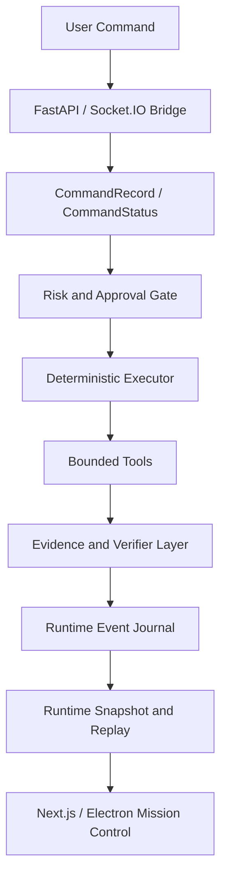

# Aegis

**Aegis is a local-first, free-first AI Mission Control system for Windows-first
operator automation, runtime truth, and bounded local AI assistance.**

Aegis is built to help a user inspect, understand, plan, and safely act on a
local computer environment. Its core value is not raw autonomy. Its core value
is trustworthy operation: backend-owned state, policy gates, approval-aware
actions, evidence-backed execution, verifier-based completion, and honest
reporting of unknowns, failures, and historical debt.

Aegis can be ambitious as a product while staying exact about current
capability. The repository now contains both real bounded product slices and
proposal-only planning surfaces. This README separates those categories.

## Current Product Position

Aegis is currently a local Mission Control workspace with:

- a governed command runtime
- real read-only maintenance diagnostics
- a local Memory OS core
- a real read-only AutoPilot repository structure audit
- deterministic Society Session proposals
- a bounded local Model Gateway for LM Studio/OpenAI-compatible local endpoints
- Aegis Model Hub for local LM Studio status, explicit probe, and proposal-only local text
- a static Skill Registry metadata catalog
- a proposal-only Bounded Agent Runtime
- Aegis Ask for read-only status explanation and safe next-step planning
- a premium Next.js/Electron Mission Control shell with Advanced diagnostics

It is not yet a full autonomous agent platform, not a general MCP runner, not a
cloud agent, and not a production security product.

## Local-First And Free-First

Aegis should work without paid services as the default product posture.

- Local deterministic logic is preferred where it is enough.
- Local model providers are optional and fail closed when unavailable.
- External or paid connectors may become optional integrations later.
- Paid/external services must not become required core dependencies.
- Cloud routing must not be inferred from provider metadata or context
  availability.

## Trust Boundaries

- Backend-owned state is the source of truth.
- Frontend state is presentation only, never authority.
- Model output is proposal-only, never truth, evidence, verifier success,
  approval, lease, capability, or execution permission.
- AutoPilot reports are read-only analysis output, not evidence.
- Memory retrieval is context, not authority.
- Skill manifests are metadata, not permission.
- Agent proposals are not execution.
- Context packages are not permission.
- Policy allow is not execution success.
- Missing evidence must not be fabricated.
- Unknown-era evidence/replay debt must not be guessed away.
- Runtime health must not be greenwashed.

## Core Principles

- **No fake systems**: UI panels must render backend snapshot, protocol event,
  event journal, registry, verifier, API, or maintenance data.
- **Smart brain, governed hands**: Aegis may propose, explain, inspect, and ask
  for approval, but side effects require backend policy and capability gates.
- **Evidence before success**: action output is not treated as proof. Desktop
  side effects require verifier evidence when applicable.
- **Approval-aware execution**: low-risk actions may run automatically, medium
  risk actions require approval, and critical actions are blocked.
- **Replayable behavior**: journaled events rebuild action history and expose
  audit context.
- **Reliable AI Computer Operator**: the first operator-facing product mode is
  still a reliable local computer assistant, but the broader architecture is an
  auditable Mission Control system.
- **Reliability Budget**: new capabilities must improve or preserve
  determinism, replayability, evidence quality, approval safety, backend truth,
  and test confidence.
- **Operational Simplicity Budget**: new capabilities should avoid unnecessary
  protocol fields, event types, FSM states, failure modes, recovery paths, or
  projection complexity.
- **Human Understandability Constraint**: a single engineer should be able to
  trace a feature's runtime flow, evidence path, and failure behavior in a short
  review.

## Current Module Map

| Area | Current status | Boundary |
| --- | --- | --- |
| Command runtime | Implemented | Backend-owned lifecycle, policy, approval, evidence, verifier surfaces. |
| Maintenance diagnostics | Implemented, read-only | Reports current and historical debt without mutating state. |
| Memory OS | Implemented local SQLite core | Explicit propose/approve/reject/delete/search; memory is not authority. |
| AutoPilot | Implemented read-only local scan | Repository structure audit only; report is not evidence. |
| Society Session | Implemented deterministic proposal surface | Role output is proposal-only. |
| Model Gateway | Implemented local provider boundary | Optional LM Studio/local OpenAI-compatible calls; output is proposal-only. |
| Aegis Model Hub | Implemented explicit local model surface | Status is config-only; probe and proposal require user clicks and do not grant authority. |
| Skill Registry | Implemented static metadata catalog | No skill execution endpoint. |
| Bounded Agent Runtime | Implemented proposal-only sessions | No tool, MCP, shell, model completion, or memory write from agents. |
| Aegis Ask | Implemented read-only explanation slice | Answers status/capability/safety questions without execution, memory writes, evidence, verifier success, or grants. |
| Frontend | Implemented premium Mission Control shell | Mission/Ask/Work/Memory/Capabilities/Advanced/Settings information architecture, English/Turkish UI preference, and Electron window controls; presentation only, no frontend authority. |
| Historical debt closure | Manifest-only quarantine applied | Unknown-era debt can be quarantined in an ignored manifest store; no journal/evidence/replay repair or archive/compaction execution. |

## Current Limitations

Aegis does not currently provide:

- uncontrolled autonomous loops
- full MCP execution
- arbitrary tool execution through agents
- cloud model fallback
- plugin marketplace
- production-grade security certification
- hallucination-proof model behavior
- vector or graph memory runtime
- full repo-audit source ingestion
- GitHub fetching or cloning
- web research execution
- historical journal archive/compaction execution

## Architecture



### Truth Surfaces

The frontend should not invent runtime state. These backend surfaces are the
source of truth:

- `src/aegis/core/protocol.py`
- `src/aegis/api/ws_bridge.py`
- `src/aegis/core/event_journal.py`
- `src/aegis/core/action_timeline.py`
- `src/aegis/core/evidence_audit.py`
- `src/aegis/tools/registry.py`
- `frontend/src/lib/socket.ts`
- `frontend/src/store/useRuntimeStore.ts`

### Contract Versioning Policy

Version suffixes such as `/1` and `/2` identify schema, verifier, and
diagnostic contracts. They are not roadmap phase labels.

- Additive fields can stay on the same contract version when old readers can
  ignore them safely.
- Breaking payload, verifier, or replay semantics require a new version.
- Old journal events and snapshots must remain readable by replay and UI
  projection code.
- The frontend must not infer success or synthesize data when it sees an unknown version; it should render unavailable or unknown state from backend truth.
- Do not keep parallel execution paths unless backward compatibility requires
  them and tests cover both paths.

## Action Proposals and Maintenance Actions

Maintenance actions start as backend-owned action proposals before any mutation
occurs. Each proposal includes:

- reason and source finding
- evidence references and observed evidence
- affected resources
- risk level and approval text
- expected outcome and verification checks
- read-only dry-run preview

The currently supported maintenance actions are `create_logging_directory` and
`create_scratch_directory`. Both create project-local directories only after
user approval. Each action is constrained to the project root, passes a
maintenance mutation safety gate, emits `maintenance-action-verifier/1`
execution evidence, and triggers a read-only maintenance rescan so snapshots and
live socket state converge on backend truth.

Future maintenance actions should remain approval-gated, evidence-backed, and
scoped by the same proposal contract.

## Canonical Docs

- [Current mission](docs/aegis-current-mission.md)
- [Capability model](docs/capability-model.md)
- [System integrity audit](docs/system-integrity-audit.md)
- [Historical evidence/replay debt closure](docs/historical-evidence-replay-debt-closure.md)
- [Memory consent policy](docs/memory-consent-policy.md)
- [Architecture realignment](docs/aegis-architecture-realignment.md)
- [Model Gateway](docs/model-gateway.md)
- [Aegis Model Hub](docs/model-hub.md)
- [Skill Registry](docs/skill-registry.md)
- [Bounded Agent Runtime](docs/bounded-agent-runtime.md)
- [Aegis Ask](docs/aegis-ask-product-slice.md)
- [Premium Mission Control shell](docs/premium-mission-control-shell.md)
- [Codex skill pack for Aegis](docs/codex-skill-pack-for-aegis.md)

Historical hackathon and foundation documents remain in `docs/` for traceability
but should not be treated as the current public product narrative.

## Repository Layout

```text
src/aegis/                 Backend runtime, API, verifier, tools, orchestration
frontend/                  Next.js / Electron Mission Control UI
tests/                     Backend, API, runtime, and source-contract tests
config/                    Runtime configuration
schemas/                   Schema and contract assets
docs/                      Canonical and historical documentation
ui/                        Historical UI notes
logs/                      Local runtime journals and logs (ignored)
data/                      Local runtime data (ignored)
scratch/                   Local temporary test/smoke artifacts (ignored)
```

## Quick Start

### Prerequisites

- Windows
- Python 3.11+
- Node.js 20+
- Git for Windows

### Backend Setup

```powershell
git clone https://github.com/WexyS/Aegis.git
cd Aegis
python -m venv .venv
.\.venv\Scripts\activate
pip install -e ".[dev]"
```

### Frontend Setup

```powershell
cd frontend
npm.cmd install
npm.cmd run build
```

### Run

From the repository root:

```powershell
.\launch_aegis.bat
```

The default backend port is `8400`. The default frontend port is `3000`.

## Validation

Run the backend test suite:

```powershell
.\.venv\Scripts\python.exe -m pytest -q
```

Build the frontend:

```powershell
cd frontend
npm.cmd run build
```

Common focused checks:

```powershell
.\.venv\Scripts\python.exe -m pytest tests\test_core\test_readme_contract.py -q
.\.venv\Scripts\python.exe -m pytest tests\test_core\test_policy_boundary.py -q
.\.venv\Scripts\python.exe -m pytest tests\test_runtime\test_threat_model_regression.py -q
git diff --check
```

## Roadmap Toward Product Slices

Near-term work should prioritize usable product slices over more placeholder
contracts:

1. Intent Router / Capability Broker.
2. Real read-only capability execution with clear approval boundaries.
3. Agent-to-skill proposal flow that can call allowed safe skills only after
   policy gates exist.
4. Model-assisted Society and AutoPilot interpretation through Model Gateway.
5. Memory Inbox and consent-based memory intelligence.
6. Optional connector/MCP layer after capability, approval, and evidence gates.

A future sprint is not accepted if it only adds skeletons, metadata, docs, or
future-gated placeholders unless it is explicitly declared as an audit,
checkpoint, or readiness sprint.

## Historical Status

The historical `foundation-baseline` tag remains a valid traceability point.
The `hackathon-agent-runtime-foundation` tag preserves the bounded Agent Runtime
foundation. These tags do not mean current runtime debt is hidden or resolved.

Raw evidence and replay diagnostics may still report `fail` while unknown-era
evidence issues, runtime snapshot alignment, and replay diagnostics remain
visible. Active runtime health can now separate the manifest-backed quarantined
debt as warning/attention when the ignored closure manifest is readable and no
current blockers remain. This is not evidence repair or replay repair.
