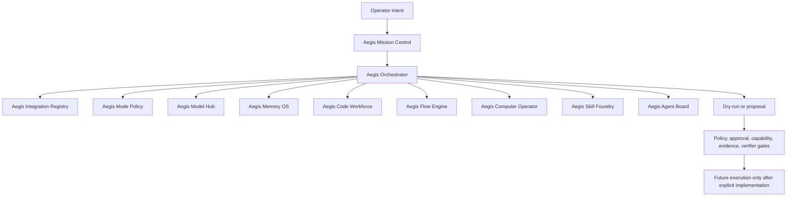

# Aegis Orchestrator Architecture

Decision: `AEGIS_ORCHESTRATOR_ARCHITECTURE_DEFINED`

## Scope

This document defines the target Aegis Orchestrator architecture. It does not
add runtime execution, process launch, external API calls, LM Studio probing,
model completions, workflow execution, tool execution, agent execution,
computer control, memory writes, evidence creation, verifier success, approval,
or capability leases.

## Target Architecture

## Components

### Aegis Mission Control

The operator-facing workspace. It presents backend-owned truth and Aegis-branded
capability areas. It must not create authority from frontend state.

### Aegis Orchestrator

The future coordinator that will route intent through policy, mode, context,
integration selection, model assistance, dry-run, approvals, execution gates,
evidence, verifier checks, and memory/audit ledgers.

The current implementation is readiness-only in
`src/aegis/core/orchestrator_readiness.py`.

### Aegis Integration Registry

The static architecture registry for planned integrations. It preserves
upstream traceability while keeping public product names Aegis-branded.

Current status: non-executing metadata only.

### Aegis Mode Policy

The policy posture layer for Safe, Balanced, Power, and YOLO Lab.

Current status: policy metadata only; no mode grants execution.

### Aegis Model Hub

The future product surface for local and optional provider planning. Current
real model calls, when explicitly enabled and requested, must go through the
existing Model Gateway boundary. Model output is proposal-only.

### Aegis Memory OS

The local memory lifecycle. Memory retrieval is context, not authority. Silent
long-term memory writes are not allowed by default.

### Aegis Code Workforce

The future area for coding-assistant orchestration. Current external coding
tools are registry records only and are not launched.

### Aegis Flow Engine

The future area for workflow planning and automation. Current records do not
start workflow engines.

### Aegis Computer Operator

The future area for high-risk computer-control behavior. Current records do
not click, type, use OCR/vision, control browser windows, or operate the desktop.

### Aegis Skill Foundry

The future area for skill design and review. Current Skill Registry metadata is
not execution permission.

### Aegis Agent Board

The future area for coordinated agent proposals. Current Bounded Agent Runtime
is proposal-only.

## LM Studio And Local Model Role

LM Studio is represented under Aegis Model Hub and through the existing Model
Gateway boundary.

Rules:

- local model calls may only happen through Model Gateway
- this architecture sprint does not call `/model-gateway/probe`
- this architecture sprint does not call `/model-gateway/complete`
- LM Studio does not need to be running for readiness
- local model output remains proposal-only
- local model output cannot grant truth, evidence, verifier success, approval,
  permission, capability lease, runtime health, or execution

Future local models should eventually understand the integration landscape as
context, but that context package would still not be authority or permission.

## Future Orchestrator Flow

Target flow:

1. Intent is classified.
2. Context is selected and privacy-checked.
3. Mode Policy is evaluated.
4. Integration Registry candidates are filtered.
5. Model assistance may draft proposal material when allowed.
6. A dry-run or proposal is returned.
7. Operator and policy gates are applied.
8. Future execution occurs only in scoped execution slices.
9. Evidence and verifier checks are collected after real execution.
10. Memory ledger and audit records preserve what happened.

Current flow stops at architecture/readiness. No execution is added.

## Trust Boundaries

- Integration metadata is not permission.
- Mode metadata is not permission.
- Model output is not truth.
- Memory retrieval is not authority.
- Skill metadata is not permission.
- Agent proposal is not execution.
- Frontend state is not backend truth.
- Evidence and verifier success can only come from backend-owned execution and
  verifier logic.

## Completion Boundary

This architecture completes:

- Integration Registry foundation
- Mode Policy foundation
- Orchestrator readiness summary
- LM Studio readiness interpretation through config-only Model Gateway status
- security and debugging plan
- tests that lock non-execution

It does not complete runtime orchestration or external integration execution.

## Remaining Risks

- Integration registry can drift unless reviewed with future connectors.
- License hints remain unknown pending review.
- Mode labels can become dangerous if UI treats them as run permission.
- Model context packaging remains future work.
- External tool/process boundaries remain unimplemented and must be gated.
